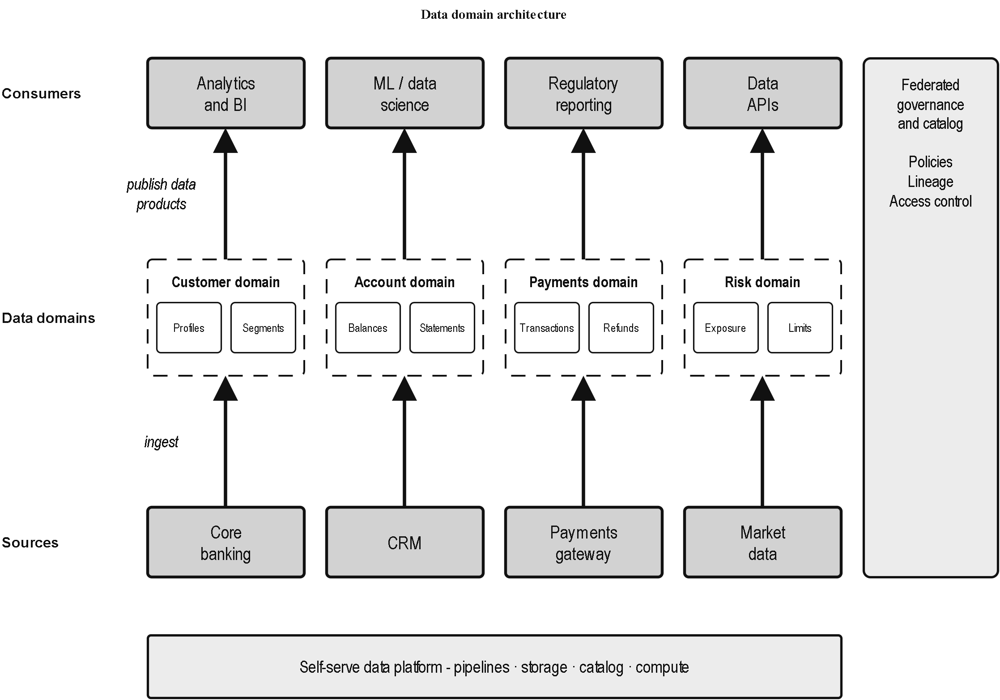
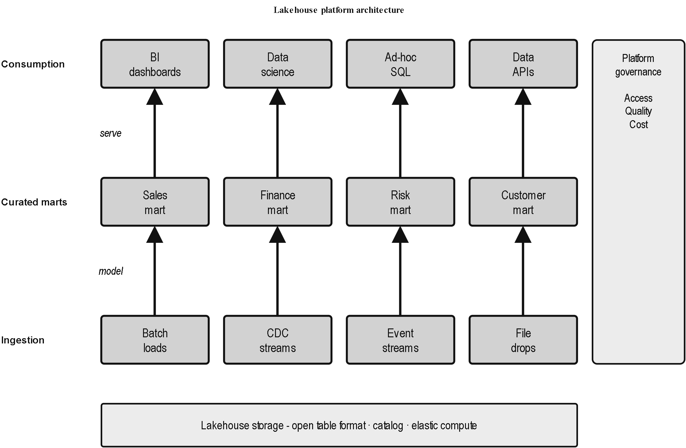

# drawio-safari-figures

Generate clean, monochrome **technical-book-style** architecture diagrams (the look of O'Reilly / Manning textbook figures) as [draw.io](https://www.drawio.com/) / diagrams.net files from a small JSON spec.

One generator, one style, a declarative spec in — a consistent book-style figure out.



## Why

Architecture diagrams drawn by hand drift in style — stroke weights, fonts, box grammar, arrowheads all wander. This packages a single, fixed visual language (heavy gray process boxes, dashed bounded-context containers holding white "data product" sub-boxes, chunky block arrows, condensed labels, layer bands) so every figure looks like it came from the same book.

The style values were tuned against real technical-book figures with an automated *odd-one-out* discriminator: render a candidate, drop it anonymously among real book figures, ask a fresh model which tile *isn't* from a book (judging visual style only — not topic or scan/print medium), apply the cited fixes, and repeat until it can't be told apart.

## Requirements

- Python 3.9+ (standard library only).
- The draw.io / diagrams.net **desktop** app, for PNG export. Point the generator at its CLI with the `DRAWIO_CLI` environment variable, e.g.
  - Windows: `C:\Program Files\draw.io\draw.io.exe` (the default)
  - macOS: `/Applications/draw.io.app/Contents/MacOS/draw.io`
  - Linux: `drawio`

You don't need draw.io just to produce the `.drawio` file — only to render a PNG.

## Usage

```bash
python safari_figure.py specs/data-domain-architecture.json -o out.drawio --png out.png
```

- `-o` sets the `.drawio` output (defaults to the spec name).
- `--png` also renders a PNG via the draw.io CLI (optionally `--png path.png`).

## Spec format

A figure is a stack of **layers** (top to bottom), with optional foundation and side bands:

```json
{
  "title": "Data domain architecture",
  "flow": "up",
  "layers": [
    {"label": "Consumers", "cells": ["Analytics\nand BI", "ML / data\nscience", "Regulatory\nreporting", "Data\nAPIs"]},
    {"label": "Data domains", "kind": "domains", "cells": [
        {"title": "Customer domain", "products": ["Profiles", "Segments"]},
        {"title": "Account domain",  "products": ["Balances", "Statements"]}
    ]},
    {"label": "Sources", "cells": ["Core\nbanking", "CRM", "Payments\ngateway", "Market\ndata"]}
  ],
  "foundation": "Self-serve data platform  -  pipelines  ·  storage  ·  catalog  ·  compute",
  "side": {"title": "Federated\ngovernance", "items": ["Policies", "Lineage", "Access control"]},
  "stage_labels": {"Sources->Data domains": "ingest", "Data domains->Consumers": "publish data products"}
}
```

Rules of thumb:

- Use `\n` inside any label to wrap onto two lines.
- A layer with `"kind": "domains"` renders **dashed bounded-context boxes** holding white data-product sub-boxes. Set `"dashed": false` (on the layer, or a single cell) for solid gray containers instead.
- `flow` (`"up"` / `"down"` / `"none"`) draws column-aligned arrows between adjacent layers. Arrows are only drawn between layers with **equal cell counts**, so keep flow layers the same width for clean columns.
- `foundation` is a full-width band beneath the grid (e.g. a platform layer); `side` is a band spanning the flow rows (e.g. governance).

See [`specs/`](specs/) for the worked examples.

## Examples

| Spec | Output |
| --- | --- |
| [`specs/data-domain-architecture.json`](specs/data-domain-architecture.json) | bounded data domains with data products, sources → domains → consumers, platform + governance bands |
| [`specs/lakehouse-platform.json`](specs/lakehouse-platform.json) | plain layered lakehouse (ingestion → curated marts → consumption) |



## Free-form figures

For diagrams that aren't a clean layered stack, import the builder API and place boxes/arrows by coordinate, reusing the same style constants:

```python
from safari_figure import SafariFigure, BOX_STYLE, DOMAIN_FRAME_DASHED, EDGE_STYLE

fig = SafariFigure(page_w=900, page_h=400)
fig.box("Request\nclosure", 40, 60, 175, 78)
fig.domain("Customer domain", ["Profiles", "Segments"], 300, 40, 175, 130)
fig.arrow((215, 99), (300, 99))
fig.write("custom.drawio")
```

The `*_STYLE` constants are the canonical look — reuse them rather than re-deriving values.

## License

MIT — see [LICENSE](LICENSE).
