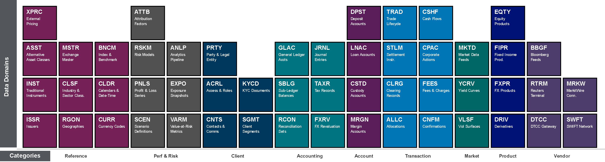

# Periodic Table of Data Domains



## Usage

```bash
python generate.py                    # default scheme (cobalt-reef)
python generate.py --scheme secondary # pixel-sampled colours
```

Outputs: `data-domains-overview.svg` and `data-domains-overview.drawio`
