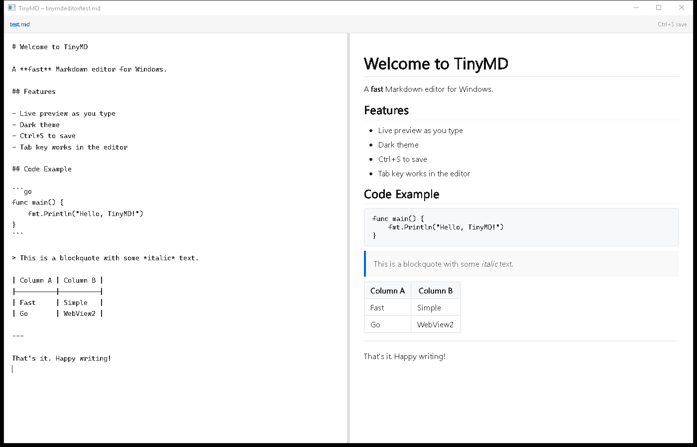
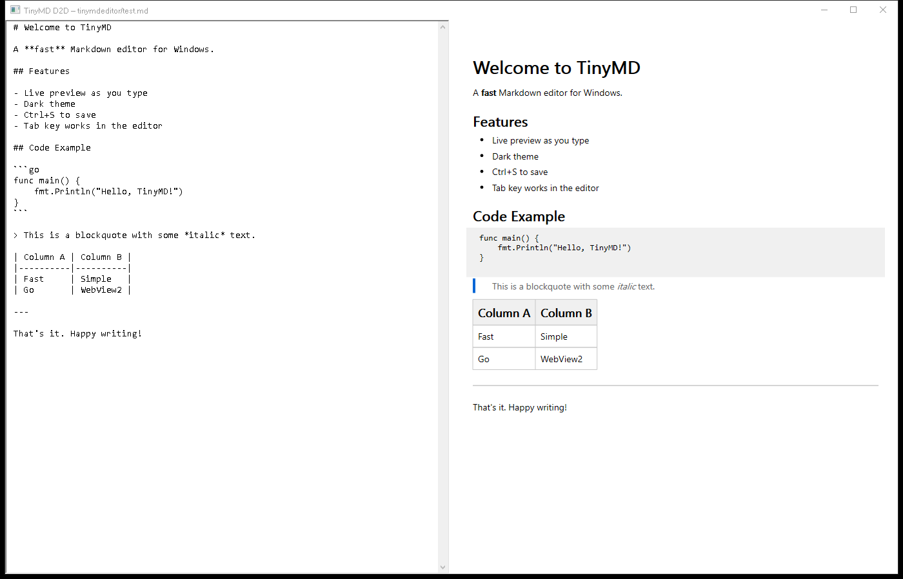
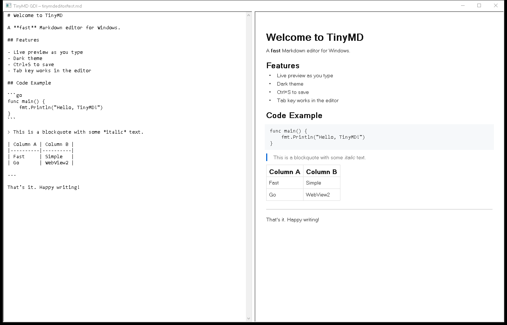
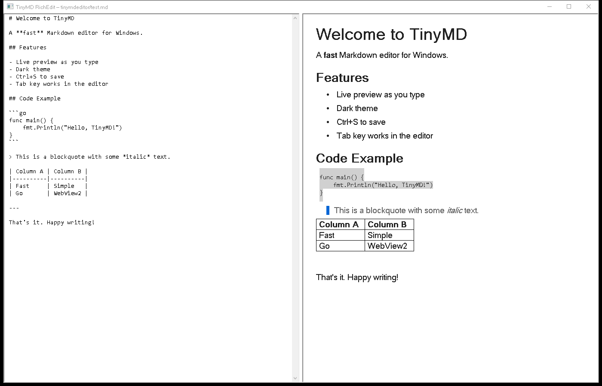

# TinyMD — Native Win32 Markdown Editor Prototypes

Single-file Go markdown editors for Windows, exploring three native rendering approaches as alternatives to WebView2. Each prototype is a self-contained `main.go` with no CGo — all Win32/COM calls go through `syscall`.

## Goal

Build an ultra-fast-startup split-pane markdown editor (left: source, right: live preview) that doesn't depend on WebView2's ~100ms cold start and 40MB runtime. The question: can native Win32 rendering get close enough in visual quality?

## The Prototypes

| | WebView2 (reference) | Direct2D | GDI | RichEdit (deprecated) |
|---|---|---|---|---|
| **Rendering** | Chromium HTML/CSS | Direct2D + DirectWrite | GDI DrawText | RichEdit50W + RTF |
| **Lines of code** | 558 | 1,349 | 1,293 | 702 |
| **Binary size** | 3.7 MB | 3.7 MB | 3.8 MB | 3.7 MB |
| **Dependencies** | WebView2 runtime | d2d1.dll, dwrite.dll | gdi32.dll | msftedit.dll |
| **Status** | Reference | Active | Active | **Deprecated** |

> **Note:** The RichEdit prototype is deprecated. It remains in the repo for reference but will not receive further improvements. RTF generation is too limited for quality markdown rendering (no reliable paragraph borders, no custom drawing).

All binaries are ~3.7 MB because the goldmark library and Go runtime dominate. The native rendering code adds negligible size.

## Screenshots

All four rendering the same `test.md` with headings, bold, bullet list, fenced code block, blockquote with italic, table, and horizontal rule.

### WebView2 (reference target)


### Direct2D + DirectWrite


### GDI


### RichEdit


## Feature Matrix

| Feature | WebView2 | Direct2D | GDI | RichEdit |
|---|---|---|---|---|
| H1/H2 headings | Bold, sized | Bold, sized | Bold, sized | Bold, sized |
| Inline **bold** | Yes | Yes | Yes | Yes (native RTF) |
| Inline *italic* | Yes | Yes | Yes | Yes (native RTF) |
| Bullet list | Filled circles | Filled circles | Bullet char | Native bullets |
| Fenced code block | Gray bg, Consolas | Gray bg, Consolas | Gray bg, Consolas | Gray bg, Consolas |
| Blockquote + blue bar | Blue bar | Blue bar (D2D rect) | Blue bar (GDI rect) | Blue block char |
| Table (auto-width) | HTML table | D2D DrawLine borders | GDI line borders | RTF \trowd cells |
| Horizontal rule | CSS border | D2D FillRect | GDI pen line | RTF \brdrb |
| Inline code spans | Yes | Yes (SetFontFamilyName) | Yes (font switch) | Yes (\f1) |
| Editor margins | Yes | Yes (EM_SETMARGINS) | Yes (EM_SETMARGINS) | Yes (EM_SETMARGINS) |
| Toolbar / filename | Yes | No | No | No |
| Scrolling | WebView handles | Custom WM_VSCROLL | Custom WM_VSCROLL | RichEdit handles |

## Architecture Notes

### Direct2D (`direct2d/`)
- COM vtable calls via `syscall.SyscallN` — no CGo, no generated bindings
- Key vtable indices verified against Rust winapi crate and MSDN: BeginDraw(48), Clear(47), DrawTextLayout(28), EndDraw(49), Resize(58)
- `D2D1_POINT_2F` (8 bytes) passed by value via `packPoint2F()` helper
- `DWRITE_TEXT_RANGE` (8 bytes) passed by value via `packTextRange()` helper
- Inline bold/italic via `IDWriteTextLayout::SetFontWeight` (vtable 32) and `SetFontStyle` (vtable 33) on character ranges
- Render target lazily created on first WM_PAINT (not during WM_CREATE when window is 0x0)
- Table cell widths pre-measured via `GetMetrics().widthIncludingTrailingWhitespace`

### GDI (`gdi/`)
- Double-buffered painting with `CreateCompatibleDC` / `BitBlt`
- Inline bold/italic via sequential `TextOutW` calls with font switching (`fontBody`, `fontBodyBold`, `fontBodyItalic`)
- Text measurement via `GetTextExtentPoint32W` (not `DrawText DT_CALCRECT`, which strips spaces)
- 2px italic overhang compensation after italic runs to prevent glyph overlap
- Table column widths measured with `DrawText DT_CALCRECT` per cell

### RichEdit (`richedit/` — deprecated)
- Simplest approach: generate RTF string from goldmark AST, load via `EM_SETTEXTEX`
- Bold/italic handled natively by RTF `\b` and `\i` commands
- Tables via `\trowd` / `\cellx` / `\intbl` / `\cell` / `\row`
- Blockquote blue bar uses Unicode LEFT HALF BLOCK char (`U+258C`) in blue — RTF `\brdrl` paragraph borders don't render in RichEdit50W
- Column widths estimated at ~150 twips/char + padding

### Shared
- All use [goldmark](https://github.com/yuin/goldmark) v1.7.8 with the table extension for markdown parsing
- goldmark v1.7.8 note: `TableRow` nodes are direct children of `Table` (no `TableBody` wrapper)
- All use the Win32 Edit control for the source editor pane
- Live preview updates on a 300ms debounce timer (WM_TIMER after EN_CHANGE)
- Ctrl+S save, window title shows filename

## Known Gaps vs WebView2

- No toolbar/filename bar at the top
- No syntax highlighting in the editor pane
- No nested lists
- No links (rendered as plain text)
- No images
- Code blocks don't have rounded corners
- Blockquote doesn't have the subtle gray background that WebView2 shows

## Building

Use the build script from the `tinymdeditor/` directory:

```bash
python build.py              # dev build (console kept for crash output)
python build.py --prod       # production build (optimized, no console)
python build.py gdi d2d      # build specific targets only
python build.py --all        # include deprecated richedit
```

Or build individually:

```bash
cd webview   && go build -ldflags="-H windowsgui" -o tinymd-webview.exe
cd gdi       && go build -ldflags="-H windowsgui" -o tinymd-gdi.exe
cd direct2d  && go build -ldflags="-H windowsgui" -o tinymd-d2d.exe
```

Usage: `gdi/tinymd-gdi.exe path/to/file.md`

## Startup Benchmark

### Time to rendered content

The metric that matters is **time from launch to fully rendered preview** — not just window frame appearing.

| Prototype | Time to content | Speedup |
|---|---|---|
| **Direct2D** | **~75 ms** | **~33x** |
| **GDI** | **~75 ms** | **~33x** |
| WebView2 | **~2,500 ms** | baseline |

The native prototypes render synchronously before showing the window — the preview is fully drawn the instant the window appears. WebView2 shows the window frame quickly (~115 ms) but the Chromium subprocess then loads and renders HTML asynchronously, taking ~2.5 seconds total before the user sees rendered content.

### Window-visible timing (automated benchmark)

Measured on Windows 10 Pro via `bench.ps1`, polling until `MainWindowHandle` is visible and sized. This captures the native prototypes accurately but **understates WebView2's real startup** since content renders asynchronously after the window appears.

| Prototype | Cold Avg | Cold Range | Warm Avg | Warm Median | Warm Range |
|---|---|---|---|---|---|
| **Direct2D** | **74 ms** | 64 - 79 ms | **73 ms** | 75 ms | 62 - 79 ms |
| **GDI** | **80 ms** | 61 - 113 ms | **75 ms** | 76 ms | 62 - 80 ms |
| WebView2 | 115 ms | 95 - 155 ms | 135 ms | 132 ms | 108 - 170 ms |

D2D and GDI are essentially tied — the Go runtime and goldmark parsing dominate, not the rendering layer.

```powershell
cd tinymdeditor
powershell -ExecutionPolicy Bypass -File bench.ps1
```

## What's Next

- Add toolbar bar with filename display
- Consider which prototype to develop further (D2D has highest visual fidelity, GDI has simplest rendering code)
